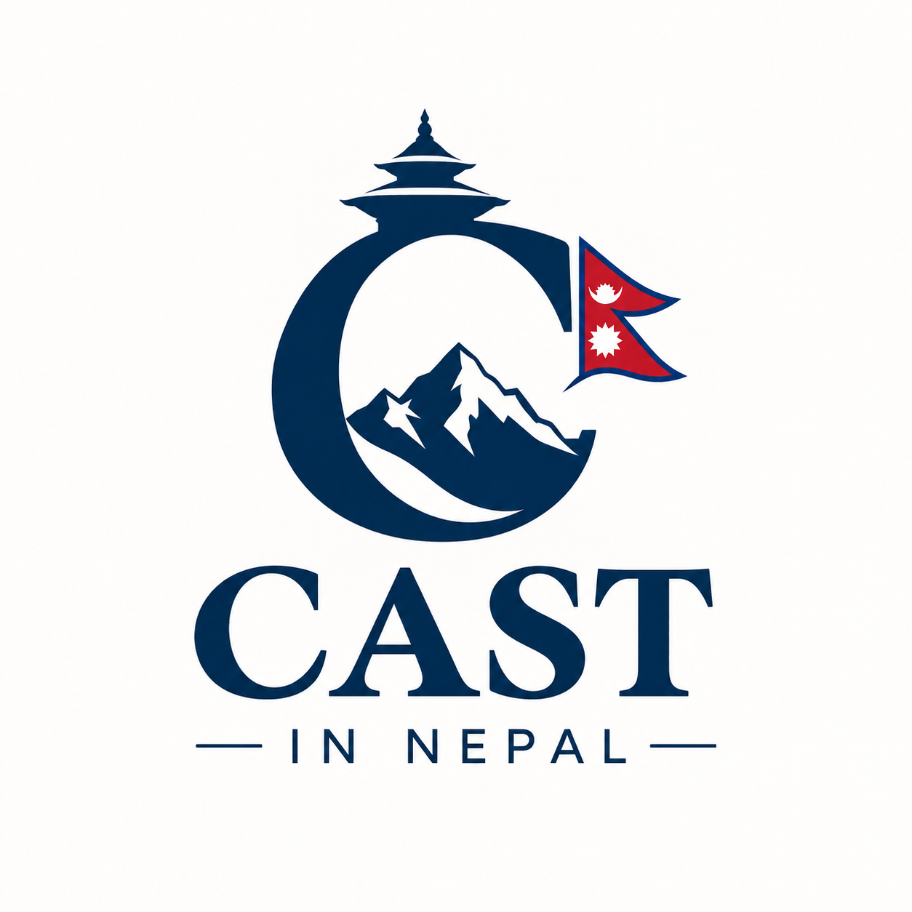

# नेपालका जातजाति, थर, गोत्र र कुलदेवता | Cast in Nepal

<p align="center">
  
</p>

<h3 align="center">
  National Lineage, Gotra, Clan & Ancestral Heritage Archive of Nepal
</h3>

<p align="center">
  <a href="https://rishav-dahal.github.io/cast-in-Nepal/"></a>
  <a href="#-how-to-contribute-missing-data"></a>
  
  
  
  
</p>

---

## 📖 Overview (परियोजना परिचय)

**Cast in Nepal** is an open-source, community-verified digital archive dedicated to documenting and preserving the rich genealogical tapestry of Nepal. It catalogues **700+ surnames**, Vedic Gotras (*गोत्र*), Pravaras (*प्रवर*), Janajati clan lineages (*सामेत, फैद, रु*), Newar Guthi traditions (*दिगु द्यः*), and ancestral deities (*कुलदेवता*) across the Himalayas, Hills, and Terai plains.

The project also features an interactive **Sagotra Compatibility Checker** (*सगोत्र विवाह जाँच*) that explains traditional exogamy principles along with modern medical genetics insights on consanguinity.

> 🌐 **Live Website**: [https://rishav-dahal.github.io/cast-in-Nepal/](https://rishav-dahal.github.io/cast-in-Nepal/)

---

## ✨ Key Features (मुख्य विशेषताहरू)

- 🔍 **Instant Bilingual Search**: Search by Nepali Devanagari or Romanized English across surnames, gotras, ancestral deities, or communities (e.g., `Dahal`, `आचार्य`, `Maharjan`, `कौडिन्य`, `मस्तो`).
- 🧬 **Interactive Sagotra Checker**: Select two surnames or gotras to instantly detect gotra collision, pravara overlap, or matrimonial compatibility according to traditional and genetic rules.
- 🌳 **Gotra Lineage Explorer**: Browse foundational sage lineages (Kaudinya, Vatsa, Atreya, Kashyap, Bharadwaj, Kaushik, Garga, etc.) and explore all associated surnames in one unified view.
- 📊 **Dual Views (Cards & Table)**: Switch seamlessly between rich visual lineage cards and a dense, sortable research table.
- 🎨 **Official Brand Design**: Built with a custom, sleek design system inspired by the national flag and the official "CAST IN NEPAL" emblem:
  - **Imperial Himalayan Navy** (`#0b2545`)
  - **Nepali Flag Crimson Red** (`#c8102e`)
  - **Glacial White** (`#ffffff`)
  - **Temple Saffron / Gold** (`#f59e0b`)
- 🌓 **Dark & Light Modes**: Seamless theme switching with persistent localStorage preferences.
- 🚀 **SEO & Schema.org Structured Data**: Fully indexed with `sitemap.xml`, `robots.txt`, Schema.org `WebSite`, `Organization`, `BreadcrumbList`, and `FAQPage` rich snippets for Google search results.

---

## 🏛️ Covered Cultural Communities (सांस्कृतिक वर्गहरू)

The archive classifies family lines into six major ethnographic clusters:

1. **खस–आर्य (Khas-Arya)**: Bahun, Chhetri, Thakuri, Dashnami/Sannyasi.
2. **नेवार समुदाय (Newar Heritage)**: Rajopadhyaya (Devabhaju), Shrestha, Uray (Tuladhar, Kansakar), Jyapu (Maharjan, Dangol), Bajracharya, Shakya, Artisan lineages with Guthi & Digu Dya (*दिगु द्यः*) traditions.
3. **आदिवासी जनजाति (Indigenous Janajati)**: Magar, Gurung, Tamang, Kirat Rai, Limbu (Samet / Phaid), Tharu, Sherpa, Thakali, Chepang.
4. **मधेशी तथा तराई समुदाय (Madhesi / Terai Lineages)**: Maithil Brahmin, Yadav, Saha, Mandal, Chaurasiya, Kurmi, Kayastha, Rajput.
5. **दलित समुदाय (Dalit Lineages & Artisans)**: Bishwakarma (Kami, Sunar, Lohar), Pariyar (Damai, Suchikar), Mijar (Sarki, Charmakar), Gandharva (Gaine), Badi.
6. **नेपाली मुस्लिम (Nepali Muslim Lineages)**: Ansari, Sheikh, Miya, Pathan, Kashmiri, Churaute.

---

## 🤝 How to Contribute Missing Data (सहयोग कसरी गर्ने?)

Nepal's genealogical history is vast and deeply localized. Many surnames have regional variations, sub-clans (*उपथर*), specific Gotras, or unique ancestral deities (*कुलदेवता*) that may still be missing or need refinement.

**We warmly welcome community contributions from researchers, elders, genealogists, and families!**

### Option 1: Submit an Issue (No Coding Required — सजिलो तरिका)

If you don't know Git or coding, you can simply open a GitHub Issue:

1. Go to the [Issues tab](https://github.com/rishav-dahal/cast-in-Nepal/issues).
2. Click **New Issue**.
3. Provide the details using this simple format:

```markdown
### 📝 Surname Contribution / Correction

- **Surname (थर)**: [e.g., Dulal / दुलाल]
- **Community / Caste (समुदाय / जात)**: [e.g., Bahun (Khas Brahmin)]
- **Cultural Category (वर्ग)**: [Khas-Arya / Newar / Janajati / Madhesi / Dalit / Muslim]
- **Gotra (गोत्र)**: [e.g., Atreya / आत्रेय]
- **Pravara (प्रवर)**: [e.g., Tryarshi: Atreya, Archananasa, Shyavashva]
- **Kuldevata (कुलदेवता)**: [e.g., Masto / Kalika]
- **Historic Region / District (उद्गम / जिल्ला)**: [e.g., Kavre, Sindhupalchok, Gandaki]
- **Subcastes / Clannames (उपथर / शाखा)**: [e.g., Purbiya]
- **Source / Reference (प्रमाण वा स्रोत)**: [e.g., Family Vamshavali book, local Guthi register, or community elders]
- **Notes / History (ऐतिहासिक विवरण)**: [Brief background or historical notes]
```

---

### Option 2: Submit a Pull Request (Direct Code / Data Contribution)

If you're comfortable with JSON and Git, you can edit the database directly:

#### Step 1: Fork and Clone the Repository
```bash
git clone https://github.com/YOUR_USERNAME/cast-in-Nepal.git
cd cast-in-Nepal
```

#### Step 2: Understand the Data Schema
Records live in `data/surnames.json`. Each entry follows this exact JSON schema:

```json
{
  "id": 698,
  "surname": "SurnameName",
  "devanagari": "नेपाली थर",
  "category": "Khas-Arya",
  "community": "Bahun (Khas Brahmin)",
  "subcaste_or_clan": "Sub-clan / Shakha names",
  "gotra": "Atreya",
  "gotra_devanagari": "आत्रेय",
  "pravara": "Tryarshi (Atreya, Archananasa, Shyavashva)",
  "kuldevata": "Ancestral Deity Name",
  "region": "District or Province name",
  "notes": "Historic context or verified genealogical reference."
}
```

> 💡 **Category values must be one of**:
> - `"Khas-Arya"`
> - `"Newar"`
> - `"Janajati"`
> - `"Madhesi"`
> - `"Dalit"`
> - `"Muslim"`

#### Step 3: Run the Dataset Builder or Update Dataset
If you modify `build_dataset.py` dictionaries, regenerate both the JSON and the JavaScript data bundle:

```bash
python build_dataset.py
```

This will automatically recompile:
- `data/surnames.json`
- `js/casteData.js`

#### Step 4: Run Data Audit & Integrity Check
Before opening a PR, always run the built-in auditor to ensure no duplicate entries or classification errors were introduced:

```bash
python audit_data.py
```

It should return:
```
Total entries: 697+
Duplicates (0):
Check oddities:
```

#### Step 5: Test Locally
Start a lightweight local server and test your changes in the browser:

```bash
# Python 3
python -m http.server 8080

# Or Node.js
npx serve .
```

Open `http://localhost:8080` and verify that the new surname appears in search, renders correctly in the cards and table, and works in the Sagotra Checker.

#### Step 6: Commit and Create a PR
```bash
git checkout -b add-surname-[surname-name]
git add data/surnames.json js/casteData.js
git commit -m "feat(data): add [Surname] with verified [Gotra] and kuldevata"
git push origin add-surname-[surname-name]
```
Then open a **Pull Request** on GitHub with a reference to your source.

---

## 📜 Contribution Standards & Fact-Checking

To maintain high academic and genealogical integrity, please follow these principles:

1. **Authentic Sources**: Whenever possible, cite a known genealogical text (*वंशावली*), ethnographic publication, official community publication, or Guthi archive.
2. **Gotra Accuracy**: Do not guess Gotras. In Nepal, certain surnames exist across multiple communities with different Gotras (e.g., *Adhikari* can be Kashyap, Bharadwaj, or Atreya depending on lineage). If a surname has multiple Gotras, specify the specific clan or add distinct records.
3. **Inclusive Respect**: Avoid derogatory terms, colloquial slurs, or hierarchical discrimination. Every heritage is recorded with dignity, cultural authenticity, and objective historical context.

---

## ⚖️ Ethical & Constitutional Commitment

This project is created strictly for **historical, genealogical, anthropological, and cultural preservation**.

In alignment with **Article 18 (Right to Equality)** and **Article 24 (Right against Untouchability and Discrimination)** of the **Constitution of Nepal**, we reject any form of social hierarchy, bias, or caste-based discrimination. We celebrate Nepal's diversity as a unified national heritage:

> *हाम्रो विविधता, हाम्रो पहिचान, हाम्रो साझा गौरव।*

---

## 🛠️ Tech Stack

- **Frontend**: Pure Semantic HTML5, Vanilla JavaScript (ES6+), and Modern CSS.
- **Data Engine**: JSON-backed local search with instant regex and fuzzy phonetic matching.
- **PWA & Offline Capable**: Standalone webmanifest support.
- **Search Engine Optimization**: Full Schema.org JSON-LD graph (`WebSite`, `Organization`, `BreadcrumbList`, `FAQPage`), XML Sitemap, and semantic `<noscript>` fallback.

---

## 📄 License

This project is licensed under the [MIT License](LICENSE). The genealogical dataset is freely available for personal, cultural, and educational research.
